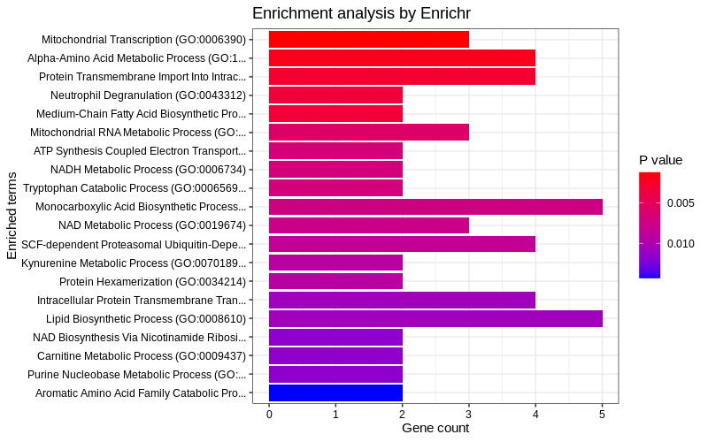

An R interface to the Enrichr database
================
Wajid Jawaid
2025-02-02

<!-- README.md is generated from README.Rmd. Please edit that file -->

[](https://cran.r-project.org/package=enrichR)
[](https://www.repostatus.org/#active)
[](https://cran.r-project.org/package=enrichR/)

# Installation

**enrichR** can be installed from Github or from CRAN.

## Github

``` r
library(devtools)
install_github("wjawaid/enrichR")
```

## CRAN

The package can be downloaded from CRAN using:

``` r
install.packages("enrichR")
```

# Usage example

**enrichR** provides an interface to the Enrichr database (Kuleshov et
al. 2016) hosted at <https://maayanlab.cloud/Enrichr/>.

By default human genes are selected otherwise select your organism of
choice. (This functionality was contributed by Alexander Blume)

## Initialising connection to Enrichr website

``` r
library(enrichR)
#> Welcome to enrichR
#> Checking connections ...
#> Enrichr ... Connection is Live!
#> FlyEnrichr ... Connection is Live!
#> WormEnrichr ... Connection is Live!
#> YeastEnrichr ... Connection is Live!
#> FishEnrichr ... Connection is Live!
#> OxEnrichr ... Connection is Live!

listEnrichrSites()
#> Enrichr ... Connection is Live!
#> FlyEnrichr ... Connection is Live!
#> WormEnrichr ... Connection is Live!
#> YeastEnrichr ... Connection is Live!
#> FishEnrichr ... Connection is Live!
#> OxEnrichr ... Connection is Live!

setEnrichrSite("Enrichr") # Human genes
#> Connection changed to https://maayanlab.cloud/Enrichr/
#> Connection is Live!
```

## Select gene-set libraries

List all available databases from Enrichr.

``` r
dbs <- listEnrichrDbs()
```

``` r
head(dbs)
```

| geneCoverage | genesPerTerm | libraryName | numTerms | appyter | categoryId |
|---:|---:|:---|---:|:---|---:|
| 13362 | 275 | Genome_Browser_PWMs | 615 | ea115789fcbf12797fd692cec6df0ab4dbc79c6a | 1 |
| 27884 | 1284 | TRANSFAC_and_JASPAR_PWMs | 326 | 7d42eb43a64a4e3b20d721fc7148f685b53b6b30 | 1 |
| 6002 | 77 | Transcription_Factor_PPIs | 290 | 849f222220618e2599d925b6b51868cf1dab3763 | 1 |
| 47172 | 1370 | ChEA_2013 | 353 | 7ebe772afb55b63b41b79dd8d06ea0fdd9fa2630 | 7 |
| 47107 | 509 | Drug_Perturbations_from_GEO_2014 | 701 | ad270a6876534b7cb063e004289dcd4d3164f342 | 7 |
| 21493 | 3713 | ENCODE_TF_ChIP-seq_2014 | 498 | 497787ebc418d308045efb63b8586f10c526af51 | 7 |

Select the 2023 GO databases.

``` r
dbs <- c("GO_Molecular_Function_2023", "GO_Cellular_Component_2023",
         "GO_Biological_Process_2023")
```

## Perform analysis

### Without background

Query with `enrichr()` using example genes available from the package.

``` r
# Load example input genes
data(input)
length(input)
#> [1] 375
head(input)
#> [1] "Nsun3"    "Polrmt"   "Nlrx1"    "Sfxn5"    "Zc3h12c"  "Slc25a39"

enriched <- enrichr(input, dbs)
#> Uploading data to Enrichr... Done.
#>   Querying GO_Molecular_Function_2023... Done.
#>   Querying GO_Cellular_Component_2023... Done.
#>   Querying GO_Biological_Process_2023... Done.
#> Parsing results... Done.
```

Now view the `"GO_Biological_Process_2023"` results from the `enriched`
object.

``` r
head(enriched[["GO_Biological_Process_2023"]])
```

| Term | Overlap | P.value | Adjusted.P.value | Old.P.value | Old.Adjusted.P.value | Odds.Ratio | Combined.Score | Genes |
|:---|:---|---:|---:|---:|---:|---:|---:|:---|
| Mitochondrial Transcription (GO:0006390) | 3/12 | 0.0012685 | 0.7123925 | 0 | 0 | 17.577061 | 117.23788 | TFAM;POLRMT;TFB1M |
| Alpha-Amino Acid Metabolic Process (GO:1901605) | 4/29 | 0.0019937 | 0.7123925 | 0 | 0 | 8.452830 | 52.55773 | SRR;ALDH6A1;KMO;GNMT |
| Protein Transmembrane Import Into Intracellular Organelle (GO:0044743) | 4/32 | 0.0028882 | 0.7123925 | 0 | 0 | 7.546015 | 44.12249 | DNAJC19;TIMM44;TRIM37;PEX1 |
| Neutrophil Degranulation (GO:0043312) | 2/5 | 0.0033774 | 0.7123925 | 0 | 0 | 35.070599 | 199.57464 | VAMP8;STXBP2 |
| Medium-Chain Fatty Acid Biosynthetic Process (GO:0051792) | 2/5 | 0.0033774 | 0.7123925 | 0 | 0 | 35.070599 | 199.57464 | ABHD3;OXSM |
| Mitochondrial RNA Metabolic Process (GO:0000959) | 3/20 | 0.0058819 | 0.7123925 | 0 | 0 | 9.301708 | 47.77237 | TFAM;POLRMT;TFB1M |

### With background

You can now add background genes when using `enrichr()`.

``` r
# Load example background
data(background)
length(background)
#> [1] 20625
head(background)
#> [1] "A1BG"     "A2M"      "NAT1"     "NAT2"     "SERPINA3" "AADAC"

enriched2 <- enrichr(input, dbs, background = background)
#> Uploading data to Speedrichr...
#>  - Your gene set... Done.
#>  - Your background... Done.
#> Getting enrichment results...
#>  - GO_Molecular_Function_2023... Done.
#>  - GO_Cellular_Component_2023... Done.
#>  - GO_Biological_Process_2023... Done.
#> Parsing results... Done.
```

Now view the `"GO_Biological_Process_2023"` results from the `enriched2`
object.

``` r
head(enriched2[["GO_Biological_Process_2023"]])
```

| Term | Rank | P.value | Adjusted.P.value | Old.P.value | Old.Adjusted.P.value | Odds.Ratio | Combined.Score | Genes |
|:---|:---|---:|---:|---:|---:|---:|---:|:---|
| Mitochondrial Transcription (GO:0006390) | 1 | 0.0003711 | 0.240515 | 0 | 0 | 27.116000 | 214.19193 | TFAM;POLRMT;TFB1M |
| Alpha-Amino Acid Metabolic Process (GO:1901605) | 2 | 0.0004145 | 0.240515 | 0 | 0 | 13.057671 | 101.69976 | SRR;ALDH6A1;KMO;GNMT |
| Protein Transmembrane Import Into Intracellular Organelle (GO:0044743) | 3 | 0.0006097 | 0.240515 | 0 | 0 | 11.656913 | 86.29136 | DNAJC19;TIMM44;TRIM37;PEX1 |
| Monocarboxylic Acid Biosynthetic Process (GO:0072330) | 4 | 0.0012176 | 0.240515 | 0 | 0 | 6.816532 | 45.74506 | ALDH1A3;SRR;SCP2;OXSM;MCAT |
| Neutrophil Degranulation (GO:0043312) | 5 | 0.0014663 | 0.240515 | 0 | 0 | 54.031872 | 352.55862 | VAMP8;STXBP2 |
| Medium-Chain Fatty Acid Biosynthetic Process (GO:0051792) | 6 | 0.0014663 | 0.240515 | 0 | 0 | 54.031872 | 352.55862 | ABHD3;OXSM |

By default, the results table from analysis with a background does not
have the ‘Overlap’ column. We can calculate the annotated genes in each
term from GMT files and replace the ‘Rank’ column with ‘Overlap’ by
setting `include_overlap = TRUE`.

``` r
enriched3 <- enrichr(input, dbs, background = background, include_overlap = TRUE)
#> Uploading data to Speedrichr...
#>  - Your gene set... Done.
#>  - Your background... Done.
#> Getting enrichment results...
#>  - GO_Molecular_Function_2023... Done.
#>    - Download GMT file... Done.
#>  - GO_Cellular_Component_2023... Done.
#>    - Download GMT file... Done.
#>  - GO_Biological_Process_2023... Done.
#>    - Download GMT file... Done.
#> Parsing results... Done.
```

Now view the `"GO_Biological_Process_2023"` results from the `enriched3`
object.

``` r
head(enriched3[["GO_Biological_Process_2023"]])
```

| Term | Overlap | P.value | Adjusted.P.value | Old.P.value | Old.Adjusted.P.value | Odds.Ratio | Combined.Score | Genes |
|:---|:---|---:|---:|---:|---:|---:|---:|:---|
| Mitochondrial Transcription (GO:0006390) | 3/12 | 0.0003711 | 0.240515 | 0 | 0 | 27.116000 | 214.19193 | TFAM;POLRMT;TFB1M |
| Alpha-Amino Acid Metabolic Process (GO:1901605) | 4/29 | 0.0004145 | 0.240515 | 0 | 0 | 13.057671 | 101.69976 | SRR;ALDH6A1;KMO;GNMT |
| Protein Transmembrane Import Into Intracellular Organelle (GO:0044743) | 4/32 | 0.0006097 | 0.240515 | 0 | 0 | 11.656913 | 86.29136 | DNAJC19;TIMM44;TRIM37;PEX1 |
| Monocarboxylic Acid Biosynthetic Process (GO:0072330) | 5/65 | 0.0012176 | 0.240515 | 0 | 0 | 6.816532 | 45.74506 | ALDH1A3;SRR;SCP2;OXSM;MCAT |
| Neutrophil Degranulation (GO:0043312) | 2/5 | 0.0014663 | 0.240515 | 0 | 0 | 54.031872 | 352.55862 | VAMP8;STXBP2 |
| Medium-Chain Fatty Acid Biosynthetic Process (GO:0051792) | 2/5 | 0.0014663 | 0.240515 | 0 | 0 | 54.031872 | 352.55862 | ABHD3;OXSM |

## Visualise results

Plot the `"GO_Biological_Process_2023"` results. (Plotting function
contributed by I-Hsuan Lin)

``` r
plotEnrich(enriched[["GO_Biological_Process_2023"]], showTerms = 20, numChar = 40, 
       y = "Count", orderBy = "P.value")
```



## Export results

Export Enrichr results as text or Excel files. By default
(i.e. `outFile = "txt"`), the results from all the selected databases
are saved into individual text files. When using `outFile = "excel"`,
the results are saved into worksheets in a single Excel 2007 (XLSX)
file. (Print function contributed by I-Hsuan Lin and Kai Hu)

``` r
# To text files
printEnrich(enriched)

# To Excel
printEnrich(enriched, outFile = "excel")
```

## Using `enrichR` behind a proxy

If your computer is behind an HTTP or HTTPS proxy, you can set the RCurl
Proxy options explicitly using `RCurlOptions` and enrichR will use the
provided settings to connect to the Enrichr database via
`httr::use_proxy()`.

For example:

``` r
options(RCurlOptions = list(proxy = 'http://ip_or_url',
                            proxyusername = 'myuser',
                            proxypassword = 'mypwd',
                            proxyport = 'port_num',
                            proxyauth = 'basic'))
```

# References

<div id="refs" class="references csl-bib-body hanging-indent"
entry-spacing="0">

<div id="ref-kuleshov_enrichr:_2016" class="csl-entry">

Kuleshov, Maxim V., Matthew R. Jones, Andrew D. Rouillard, Nicolas F.
Fernandez, Qiaonan Duan, Zichen Wang, Simon Koplev, et al. 2016.
“Enrichr: A Comprehensive Gene Set Enrichment Analysis Web Server 2016
Update.” *Nucleic Acids Res* 44 (Web Server issue): W90–97.
<https://doi.org/10.1093/nar/gkw377>.

</div>

</div>
