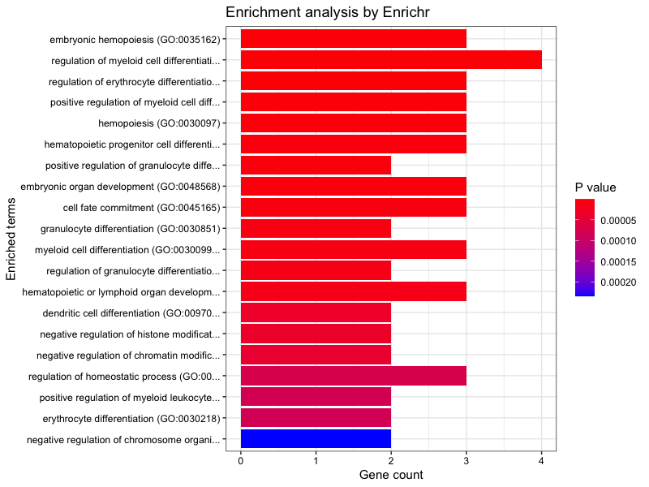

An R interface to the Enrichr database
================
Wajid Jawaid
2023-04-12

<!-- README.md is generated from README.Rmd. Please edit that file -->

[](https://cran.r-project.org/package=enrichR)
[](https://www.repostatus.org/#active)
[](https://cran.r-project.org/package=enrichR/)

# Installation

**enrichR** can be installed from Github or from CRAN.

## Github

``` r
library(devtools)
install_github("wjawaid/enrichR")
```

## CRAN

The package can be downloaded from CRAN using:

``` r
install.packages("enrichR")
```

# Usage example

**enrichR** provides an interface to the Enrichr database (Kuleshov et
al. 2016) hosted at <https://maayanlab.cloud/Enrichr/>.

By default human genes are selected otherwise select your organism of
choice. (This functionality was contributed by Alexander Blume)

``` r
library(enrichR)
listEnrichrSites()
#> Enrichr ... Connection is Live!
#> FlyEnrichr ... Connection is available!
#> WormEnrichr ... Connection is available!
#> YeastEnrichr ... Connection is available!
#> FishEnrichr ... Connection is available!
#> OxEnrichr ... Connection is available!
setEnrichrSite("Enrichr") # Human genes
#> Connection changed to https://maayanlab.cloud/Enrichr/
#> Connection is Live!
```

Then find the list of all available databases from Enrichr.

``` r
dbs <- listEnrichrDbs()
```

``` r
head(dbs)
```

| geneCoverage | genesPerTerm | libraryName                      | numTerms | appyter                                  | categoryId |
|-------------:|-------------:|:---------------------------------|---------:|:-----------------------------------------|-----------:|
|        13362 |          275 | Genome_Browser_PWMs              |      615 | ea115789fcbf12797fd692cec6df0ab4dbc79c6a |          1 |
|        27884 |         1284 | TRANSFAC_and_JASPAR_PWMs         |      326 | 7d42eb43a64a4e3b20d721fc7148f685b53b6b30 |          1 |
|         6002 |           77 | Transcription_Factor_PPIs        |      290 | 849f222220618e2599d925b6b51868cf1dab3763 |          1 |
|        47172 |         1370 | ChEA_2013                        |      353 | 7ebe772afb55b63b41b79dd8d06ea0fdd9fa2630 |          7 |
|        47107 |          509 | Drug_Perturbations_from_GEO_2014 |      701 | ad270a6876534b7cb063e004289dcd4d3164f342 |          7 |
|        21493 |         3713 | ENCODE_TF_ChIP-seq_2014          |      498 | 497787ebc418d308045efb63b8586f10c526af51 |          7 |

View and select your favourite databases. Then query enrichr, in this
case I have used genes associated with embryonic haematopoiesis.

``` r
dbs <- c("GO_Molecular_Function_2015", "GO_Cellular_Component_2015", "GO_Biological_Process_2015")
enriched <- enrichr(c("Runx1", "Gfi1", "Gfi1b", "Spi1", "Gata1", "Kdr"), dbs)
#> Uploading data to Enrichr... Done.
#>   Querying GO_Molecular_Function_2015... Done.
#>   Querying GO_Cellular_Component_2015... Done.
#>   Querying GO_Biological_Process_2015... Done.
#> Parsing results... Done.
```

Now view the results table.

``` r
enriched[["GO_Biological_Process_2015"]]
```

You can give many genes.

``` r
data(genes790)
length(genes790)
head(enrichr(genes790, c('LINCS_L1000_Chem_Pert_up'))[[1]])
```

| Term                                                             | Overlap | P.value | Adjusted.P.value | Old.P.value | Old.Adjusted.P.value | Odds.Ratio | Combined.Score | Genes                  |
|:-----------------------------------------------------------------|:--------|--------:|-----------------:|------------:|---------------------:|-----------:|---------------:|:-----------------------|
| embryonic hemopoiesis (GO_0035162)                               | 3/24    | 0.0e+00 |        0.0000083 |           0 |                    0 |   951.0952 |      16465.833 | KDR;GATA1;RUNX1        |
| regulation of myeloid cell differentiation (GO_0045637)          | 4/156   | 1.0e-07 |        0.0000083 |           0 |                    0 |   261.0789 |       4374.968 | GFI1B;SPI1;GATA1;RUNX1 |
| regulation of erythrocyte differentiation (GO_0045646)           | 3/36    | 1.0e-07 |        0.0000112 |           0 |                    0 |   604.8788 |       9710.235 | GFI1B;SPI1;GATA1       |
| positive regulation of myeloid cell differentiation (GO_0045639) | 3/74    | 1.0e-06 |        0.0000762 |           0 |                    0 |   280.6056 |       3886.803 | GFI1B;GATA1;RUNX1      |
| hemopoiesis (GO_0030097)                                         | 3/95    | 2.1e-06 |        0.0001299 |           0 |                    0 |   216.3261 |       2832.846 | KDR;GATA1;RUNX1        |
| hematopoietic progenitor cell differentiation (GO_0002244)       | 3/106   | 2.9e-06 |        0.0001507 |           0 |                    0 |   193.1165 |       2465.031 | SPI1;GATA1;RUNX1       |

Plot Enrichr GO-BP output. (Plotting function contributed by I-Hsuan
Lin)

``` r
plotEnrich(enriched[[3]], showTerms = 20, numChar = 40, y = "Count", orderBy = "P.value")
```



# References2

<div id="refs" class="references csl-bib-body hanging-indent">

<div id="ref-kuleshov_enrichr:_2016" class="csl-entry">

Kuleshov, Maxim V., Matthew R. Jones, Andrew D. Rouillard, Nicolas F.
Fernandez, Qiaonan Duan, Zichen Wang, Simon Koplev, et al. 2016.
“[Enrichr: A Comprehensive Gene Set Enrichment Analysis Web Server 2016
Update](https://www.ncbi.nlm.nih.gov/pmc/articles/PMC4987924).” *Nucleic
Acids Res* 44 (Web Server issue): W90–97.

</div>

</div>
